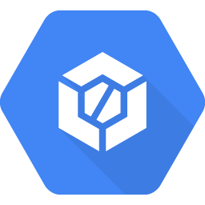
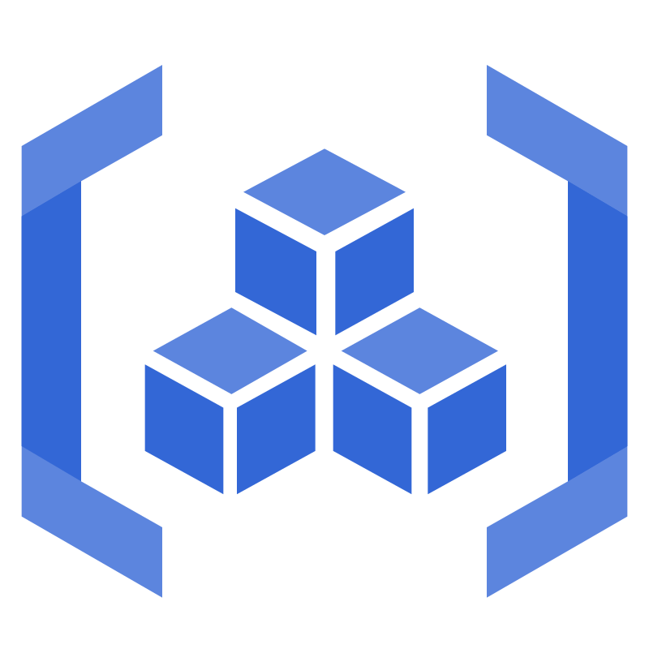
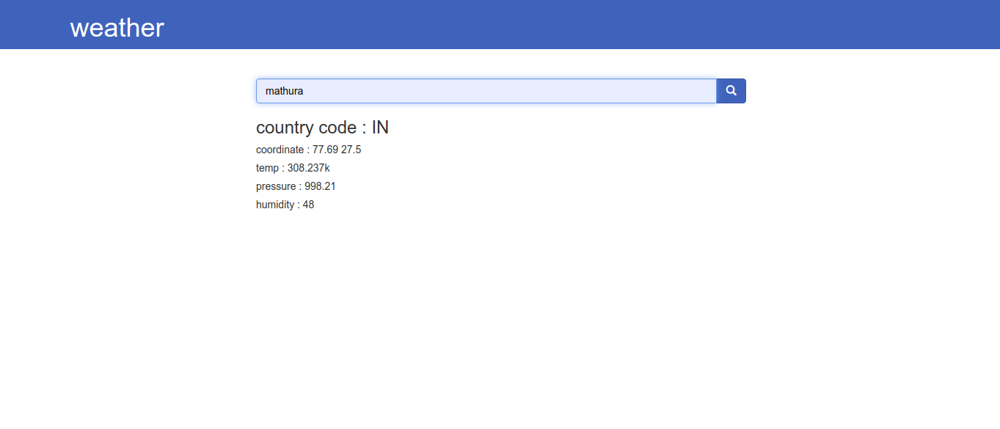
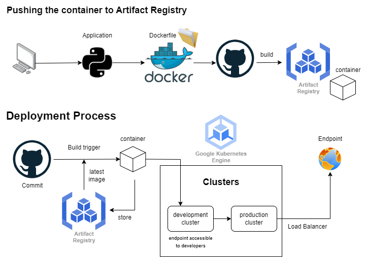

# GCP-DevOps-Lifecycle

## Introduction
Implemented a complete DevOps lifecycle using the Google Cloud Platform. The goal was to deploy a Python Flask App to Kubernetes cluster created by the Google Kubernetes Engine, using Google Cloud's internal tools such as Cloud Build for CICD and Triggers for automatic builds and deployment to Kubernetes cluster. Exposed application to an external endpoint using Load Balancer service in Kubernetes.

## Tools used

<table>
  <tr>
    <td align="center">
      
    </td>
    <td align="center">
      
    </td>
    <td align="center">
      
    </td>
    <td align="center">
      
    </td>
  </tr>
  <tr>
    <td align="center">
      
    </td>
    <td align="center">
      
    </td>
    <td align="center">
      
    </td>
    <td align="center">
      
    </td>
  </tr>
</table>
Left to right: Git, GitHub, Google Cloud, Docker, Kubernetes, Google Kubernetes Engine, Google Cloud Build, Google Artifact Registry.

## App deployed: weather-flask

Flask is a lightweight framework written in Python. It is lightweight because it does not require particular tools or libraries and allow rapid web development. today we will create a weather app using flask as a web framework. this weather web app will provide current weather updates of cities searched.

learn how to make <a href="https://www.geeksforgeeks.org/create-a-weather-app-using-flask-python/" target="_blank">GeeksforGeeks</a>

## Steps followed

- Created a GitHub repository with branch protection, so that not everybody can push to the main branch.

- Python Flask App:
Dockerized the flask app, built Dockerfile and pushed it to Google Cloud Artifact Registry

- Created Google Kubernetes Engine cluster.

- Used Cloud shell to connect and interact with the GKE cluster.

- Designed CICD process using Cloud Build and Artifact Registry.
Used Trigger to automate deployment to GKE Cluster and push image build to Artifact Registry.

- Created Namespace for GKE cluster.

- Exposed application to endpoint using External Load Balancer type Service in Kubernetes.

- Setup Development Environment in GitHub and Google Cloud and create separate namespace for Development Cluster Deployment Purpose.

- Made sure cluster can be scaled with additional replicas if load is increased; first in the development cluster and then in the production cluster.

